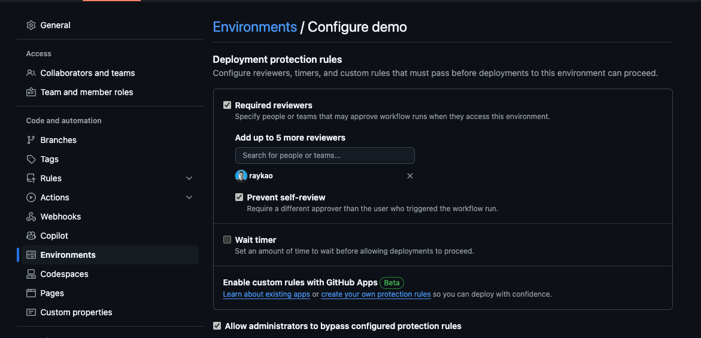

# Project Protomatter Bootstrap Template Repository

This is a [GitHub template repository](https://docs.github.com/en/repositories/creating-and-managing-repositories/creating-a-template-repository) used by [Project Protomatter](https://github.com/DevExpGbb/project-protomatter/) to bootstrap the creation of a new self-deployment project repo to demo IssueOps or as a base/starter for new demos that will deploy their own self contained Azure Infrastructure via GitHub Issues/Actions.

## GH Secrets

The following secrets should be generated by the default boostrapper.

```bash
ARM_TENANT_ID
ARM_SUBSCRIPTION_ID
ARM_CLIENT_ID
TF_STATE_STORAGE_ACCOUNT_RESOURCE_GROUP_NAME
TF_STATE_STORAGE_ACCOUNT_NAME
TF_STATE_STORAGE_CONTAINER_NAME
```

> [!IMPORTANT]  
> Environments and Worflow templates: the example workflows in this repository template have a hard coded environment of "```demo```" and as such may differ from the environment name entered for your provisioned target bootstrap environment.

> [!NOTE]  
> The target bootstrap environment is created via Terraform and has the protection rule "```Prevent self-review```" disabled for demo purposes, allow you to self-approve a deployment.  In a GitHub Enterprise setting an Administrator can not by-pass this rule (see: [Allow administrators to bypass configured protection rules](https://docs.github.com/en/actions/managing-workflow-runs-and-deployments/managing-deployments/managing-environments-for-deployment#allow-administrators-to-bypass-configured-protection-rules)).  Enable it for non-demo "best practice" security reasons.  See screenshot below.  


